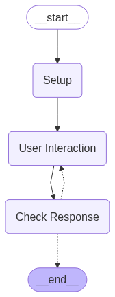

# Building and Benchmarking LLM-based Natural Language Database Conversational Interfaces

## Setup Instructions

Before running the project, make sure to configure the following:

### 1. LLM API Configuration

Create a `.env` file in the root directory with the required settings for your LLM API (e.g., API key, model name, endpoint URL).

Example:

```txt
AZURE_OPENAI_BASE_URL=""
AZURE_OPENAI_API_KEY=""
AZURE_OPENAI_API_VERSION=""
```

### 2. Database Configuration

Make a copy of the file: [`mondial_db_connection_example.json`](/connections/) and rename it to `mondial_db_connection.json`. Then, fill in the connection details for your Mondial database (host, port, user, password, database name, etc.).

The database schema used (Mondial) is located in : [`/connections/database_schema/mondial_gpt.sql`](`/connections/database_schema/mondial_gpt.sql`)

In addition in the same `.env` as the LLM API configuration you must add the following:

```txt
EXPERIMENT_NAME = ""
DATABASE_TABLES = []
EXPERIMENT_SCHEMA = ""
DATASET_SYNTHETIC = ""
EMBEDDINGS_FILE = ""
```

If you don´t have the Dataset_Synthetic and Embeddings_File you can leave as ""

## Dialogue Dataset Generation

To generate the dialogue dataset, run the following notebook: [`dialogue_dataset_creation`](/eval_agent/dataset_generation/dialogue_dataset_creation.ipynb)

This notebook will produce two files:

- `./eval_agent/dialogue/joins/join_combinations.csv`  
  Contains table join combinations used for generating queries.

- `./eval_agent/dialogue/dataset/mondial_dialogue_dataset.json`  
  The dialogue dataset in JSON format.

## Text-to-SQL Tool

You can test the Text-to-SQL tool by running the notebook: [text_to_sql_test](eval_agent\text2sql_agent\text_to_sql\text_to_sql_test.ipynb)

This tool is composed of two main components:

- **Query Decomposition**
- **Dynamic Few-Shot Examples**

The few-shot examples were synthetically generated and are provided in a `.zip` file. After dowloading the files in [Drive-Synthetic Dataset](https://drive.google.com/file/d/1R1rX1pbxL4kxfYknWMYpGQGTfy-fokbG/view?usp=sharing), you should have access to the following CSV `mondial_dataset_GPT35_and_4_20240317-200242-relational_schema.csv` and NPY `mondial_embeddings_GPT35_and_4_20240317-200242-relational_schema.npy`. Both files must be placed in the following folder `eval_agent/text2sql_agent/text_to_sql`.

You need to add, for your database, in the folder `eval_agent/text2sql_agent/text_to_sql/prompts`, a `rag_prompt_view_sql_queries_{your-database-schema-name}.txt` file.
Also, in the folder `eval_agent/text2sql_agent`, you will need to add a `prompts_{your-experiment-name}.py` file

## Evaluator Agent



The Evaluator Agent is composed of two main components:

- **User Interaction**: Includes the **User Agent**, which simulates user behavior, and the **Dialogue Control Agent**, responsible for managing the flow of conversation.
- **CheckResponse**: Uses an LLM to evaluate the results of the dialogue agent and the Text-to-SQL component (i.e., **LLM as Judge**).

To run the evaluation process, execute the following notebook: [simulating_chat](eval_agent\user_agent\simulating_chatting.ipynb)

> If you want to run the evaluator **without** the memory component, simply set the `memory` attribute to `False` in the notebook.

## Requirements

Make sure you have all required dependencies installed. You can install them via:

```bash
pip install -r requirements.txt
```
