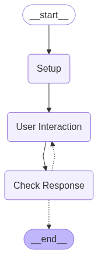

# Evaluation of Conversational Text-to-SQL Agents

## Introduction

This repository contains the data, prompts, the URL sessions of the LLM runs, and additional code that complements the paper: 

**"Automated Evaluation of Conversational Text-to-SQL Agents by Schema Traversal"**

*Abstract*

Conversational text-to-SQL agents allow users to interact with databases through dialogues formulated in natural language. They allow users to submit partially formulated questions that depend on previous questions and to change the dialogue context. They may also ask users to disambiguate questions. This article addresses the problem of testing a conversational text-to-SQL agent for a given database D. To achieve this goal, the paper introduces a procedure to create a dialogue test dataset T for D, a collection of dialogue performance metrics, and an evaluation agent that simulates a user interacting with the conversational text-to-SQL agent to access D, guided by T. The procedure that creates T simulates a user directly traversing the database schema and does not rely on manually defined users’ questions and SQL queries. Then, the article describes a set of experiments to assess the quality of dialogue test datasets automatically created for three openly available databases and to test conversational text-to-SQL agents over such databases. The experiments suggest that the dialogue test datasets and the evaluation agent help differentiate the performance of conversational text-to-SQL agents across the databases of interest before deployment.

## Repository Structure

### Prompts
The prompts used in the project are organized into the following areas:

#### Generation of Dialogue Test Datasets

- [`dialogue_generation_prompt.txt`](/eval_agent/dataset_generation/prompts/dialogue_generation_prompt.txt)
- [`columns_combinations_prompt.txt`](/eval_agent/dataset_generation/prompts/columns_combinations_prompt.txt)
- [`joins_combinations_prompt.txt`](/eval_agent/dataset_generation/prompts/joins_combinations_prompt.txt)

#### Evaluator Agent
- [`prompts.py`](/eval_agent/user_agent/prompts.py)
- The above file contains the `USER_INTERACTION_PROMPT`, the `FEEDBACK_CLASSIFICATION_PROMPT`, the `AI_JUDGE_INTENTION_PROMPT`, and the `AI_JUDGE_RESPONSE_CORRECTNESS_PROMPT`.

#### Conversational Agent
- The prompts below are used for the ReAct-Based and Non-ReAct Conversational Text-to-SQL Agent used in the experiments.
- [`prompts.py`](/eval_agent/conversational_agent/prompts.py). `assistant_prompt` is for the ReAct-Based Agent and `llm_prompt` is for the Non-ReAct Agent.

#### Text-to-SQL tool
- The tool, used by the ReAct-Based Conversational Agents, prompts
- [`prompts`](/eval_agent/conversational_agent/text_to_sql_tool/prompts)
- The aboove folder has the [`prompt_decomposer.txt`](/eval_agent/conversational_agent/text_to_sql_tool/prompts/prompt_decomposer.txt) used in the Dynamic Few Shot Examples implementation
- The rag_prompt files are the main Text-to-SQL prompt, each corresponding to a specific database.

### [`Generation of Dialogue Test Datasets`](/eval_agent/dataset_generation/)
   
- This folder contains the procedure for generating dialogue test datasets to assess the performance of a conversational text-to-SQL agent on a given database.
- The notebook `dialogue_dataset_creation.ipynb` is responsible for running the test dialogue dataset generation.
	 
### [`Automated Evaluation of Conversational text-to-SQL Agents`](/eval_agent/user_agent/)
   
- This folder contains the evaluation agent that, given a conversational text-to-SQL agent A and a dialogue test dataset T over a database D, simulates a user interacting with A to retrieve data from D, by consuming the extended dialogues in T.
- The `simulating_chatting.ipynb` notebook is responsible for running the project simulation of a user interacting with a chatbot conversational test-to-SQL agent.

### [`Conversational Agent`](eval_agent/conversational_agent)
- This folder contains the implementation of the ReAct-based and Non-ReAct Conversational Text-to-SQL Agents

### [`Results`](eval_agent/results)
- This folder contains the results of the experiments. It is organized into the following subfolders:

#### [`Dialogue Evaluation`](/eval_agent/Results/Dialogue_Evaluation)

- This folder contains the database schemas, the dialogue test datasets, and the results of the dialogue evaluations, in separate documents with the prompts and LLM sessions.

#### [`Evaluation of Text-to-SQL Conversational Agents`](/eval_agent/Results/Evaluation_of_Text-to-SQL_Conversational_Agents)

- This folder contains the evaluated conversational Text-to-SQL agents.

- [`collect_metrics.ipynb`](/eval_agent/Results/Evaluation_of_Text-to-SQL_Conversational_Agents/collect_metrics.ipynb) notebook is responsible for collecting the performance metrics of the Conversational Text-to-SQL in the simulation.

## Replicating the Experiments
- A guide to replicate the experiments goes as follows:

### Setup Configurations

Before running the project, make sure to configure the following:

### 1. LLM API Configuration

- Create a `.env` file in the root directory with the required settings for your LLM API (e.g., API key, model name, endpoint URL).
- The file [`.env.example`](/.env.example) has all the required environment variables. If you are using AWS Bedrock you can just set the api key in the .env and leave the OPENAI variables empty. Make sure to add a model to each model's environment variables.
- IMPORTANT: The experiments project supports only Azure and AWS Bedrock as LLM model providers.

```txt
OPENAI_BASE_URL=""
OPENAI_API_KEY=""
OPENAI_API_VERSION=""

AWS_BEARER_TOKEN_BEDROCK=""

CONVERSATIONAL_AGENT_MODEL = "us.anthropic.claude-haiku-4-5-20251001-v1:0"
CONVERSATIONAL_AGENT_MODEL_PROVIDER = "aws_bedrock"

EVALUATOR_MODEL = "gpt-5.6-sol"
EVALUATOR_MODEL_PROVIDER = "azure"
```

### 2. Database Configuration

Make a copy of the file: [`experiment_db_connection_example.json`](/connections/) and rename it to `your-experiment_db_connection.json`. Then, fill in the connection details for your Experiment database (host, port, user, password, database name, etc.).

```
{
    "DB_HOST":"",
    "DB_PORT":"1521",
    "DB_USER_NAME":"",
    "DB_PASS":"",
    "DB_NAME":"",
    "SQL_DRIVER":"oracle+oracledb",
    "SERVICE_NAME":"orcl...",
    "SCHEMA":"",
    "KEYWORD_SEARCH_API_URL":"<Not required>"
}
```

The database schemas used in the Mondial and Kaggle experiments are located in: [`/connections/database_schema/`](`/connections/database_schema/`)

In addition, in the same `.env` as the LLM API configuration, you must add the following:

```txt
EXPERIMENT_NAME = ""
EXPERIMENT_SCHEMA = ""
DATASET_SYNTHETIC = ""
EMBEDDINGS_FILE = ""
```

If you don´t have the Dataset_Synthetic and Embeddings_File you can leave it as ""

If trying to create a new experiment with a database different from Bird, Kaggle, and Mondial, make sure to do the following:

- In the folder [`eval_agent/dataset_generation/experiments_dataset`](`eval_agent/datset_generation/experiments_dataset`), you need to make a copy of the `example_dataset.py` file and add `your-experiment_dataset.py` with the following content:

`DATABASE_TABLES = ["table1", "table2", "table3",...]`

This will include the listed tables of your database in the dialogue generation

- Add a json file `your-experiment_tables_description.json` in the folder [`dataset_description`](eval_agent/dataset_generation/dataset_description).

### Dialogue Dataset Generation

To generate the dialogue dataset, run the following notebook: [`dialogue_dataset_creation`](/eval_agent/dataset_generation/dialogue_dataset_creation.ipynb)

This notebook will produce three files:

- `./eval_agent/dialogue/columns_combos/{experiment}_columns_combinations.csv`
	Contains a table of column combinations of each table used to generate the dialogues

- `./eval_agent/dialogue/joins/{experiment}_join_combinations.csv`  
  Contains a table of join combinations used to generate the dialogues.

- `./eval_agent/dialogue_dataset/{experiment}_dialogue_dataset.json`  
  The dialogue dataset in JSON format.

### Text-to-SQL Tool

You can test the text-to-SQL tool by running the notebook: [text_to_sql_test](eval_agent\conversational_agent\text_to_sql_tool\text_to_sql_test.ipynb)

This tool is composed of two main components:

- **Query Decomposition**
- **Dynamic Few-Shot Examples**

The few-shot examples were synthetically generated and are provided in a `.zip` file. After downloading the files in [Drive-Synthetic Dataset](https://drive.google.com/file/d/1R1rX1pbxL4kxfYknWMYpGQGTfy-fokbG/view?usp=sharing), you should have access to the following CSV `mondial_dataset_GPT35_and_4_20240317-200242-relational_schema.csv` and NPY `mondial_embeddings_GPT35_and_4_20240317-200242-relational_schema.npy`. Both files must be placed in the following folder `eval_agent/conversational_agent/text_to_sql_tool/synthetic_dataset/`.

You need to add, for your database, in the folder `eval_agent/conversational_agent/text_to_sql_tool/prompts`, a `rag_prompt_view_sql_queries_{your-database-schema-name}.txt` file.
Also, in the folder `eval_agent/conversational_agent/schemas`, you will need to add a `{your-experiment-name}_schema.py` file. For Mondial, Bird, and Kaggle, these files were already added.

### Evaluator Agent



The Evaluator Agent is composed of two main components:

- **User Interaction**: Includes the **User Agent**, which simulates user behavior, and the **Dialogue Control Agent**, responsible for managing the flow of conversation.
- **CheckResponse**: Uses an LLM to evaluate the results of the dialogue agent and the Text-to-SQL component (i.e., **LLM as Judge**).

To run the evaluation process, execute the following notebook: [simulating_chat](eval_agent\user_agent\simulating_chatting.ipynb)

> If you want to run the evaluator **without** the memory component, simply set the `memory` attribute to `False` in the notebook.
> If you want your conversational agent to be ReAct-based then set the environment variable `RAW_LLM_CONVERSATIONAL_AGENT = "False"`, else set it `True`.

### Results

The Conversational Agent performance results can be retrieved by executing the [collect_metric.ipynb](eval_agent/Results/Evaluation_of_Text-to-SQL_Conversational_Agents/collect_metrics.ipynb) notebook. Make sure to set the right path for the simulation results in the notebook.

### Requirements

Make sure you have all the required dependencies installed. You can install them via:

```bash
pip install -r requirements.txt
```

